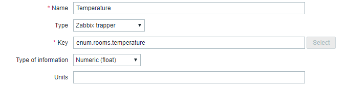
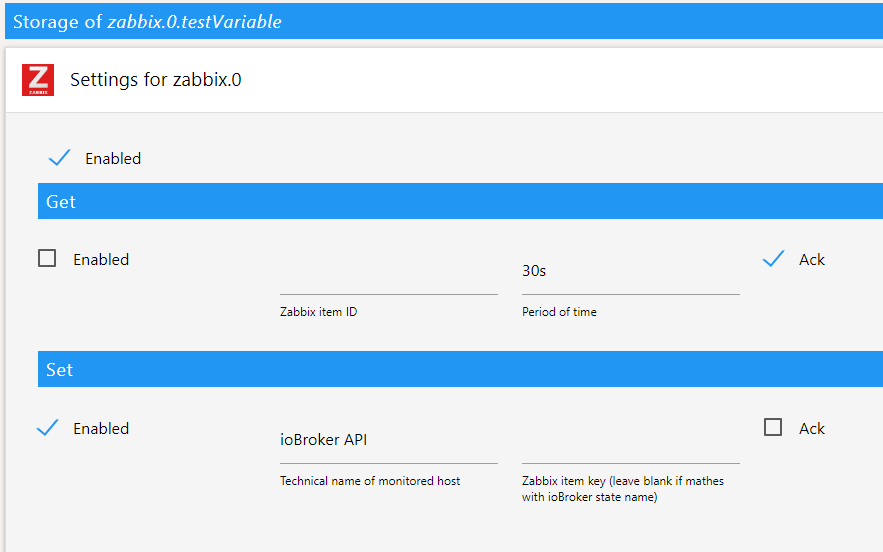

# ioBroker.zabbix

This adapter connects ioBroker with Zabbix Server.

### Getting started

You are almost done, only a few steps left:
1. For send data to Zabbix you need to create new item in Zabbix with "Zabbix trapper" type. It is recommended that Zabbix item key will be same as object id in ioBroker.

2. For get value from Zabbix item, item ID from Zabbix used. Item ID can be obtained from URL of specific Zabbix item, e.g.: https://zabbix.host/history.php?action=showgraph&itemids[]=30277, in this case item ID is 30277.
3. Now in ioBroker open any choosed object and select checkbox enable under Get or Set section. 
Period of time - with this interval value will be fetched from Zabbix API. Format of this field - 1d2h35m30s, where d - days, h - hours, m - minutes and s - seconds.
Technical name of monitored host - host name from Zabbix. If leave Zabbix item key blank will be used object id. 
Ack - only state with this acknowledge will be sent to Zabbix (Checked Ack - ack:true, unchecked - ack:false).

4. All done, states with Set enable will be posted to Zabbix each time it changes with specified Ack. States with Get enable will be fetched from Zabbix API in specified interval.

## Changelog

### 0.0.4
Updated for support new version of Admin UI
### 0.0.1
* (shady2k) initial release

## License
MIT License

Copyright (c) 2022 Author <shady2k@gmail.com>

Permission is hereby granted, free of charge, to any person obtaining a copy
of this software and associated documentation files (the "Software"), to deal
in the Software without restriction, including without limitation the rights
to use, copy, modify, merge, publish, distribute, sublicense, and/or sell
copies of the Software, and to permit persons to whom the Software is
furnished to do so, subject to the following conditions:

The above copyright notice and this permission notice shall be included in all
copies or substantial portions of the Software.

THE SOFTWARE IS PROVIDED "AS IS", WITHOUT WARRANTY OF ANY KIND, EXPRESS OR
IMPLIED, INCLUDING BUT NOT LIMITED TO THE WARRANTIES OF MERCHANTABILITY,
FITNESS FOR A PARTICULAR PURPOSE AND NONINFRINGEMENT. IN NO EVENT SHALL THE
AUTHORS OR COPYRIGHT HOLDERS BE LIABLE FOR ANY CLAIM, DAMAGES OR OTHER
LIABILITY, WHETHER IN AN ACTION OF CONTRACT, TORT OR OTHERWISE, ARISING FROM,
OUT OF OR IN CONNECTION WITH THE SOFTWARE OR THE USE OR OTHER DEALINGS IN THE
SOFTWARE.

Copyright (c) 2022 shady2k shady2k@gmail.com
